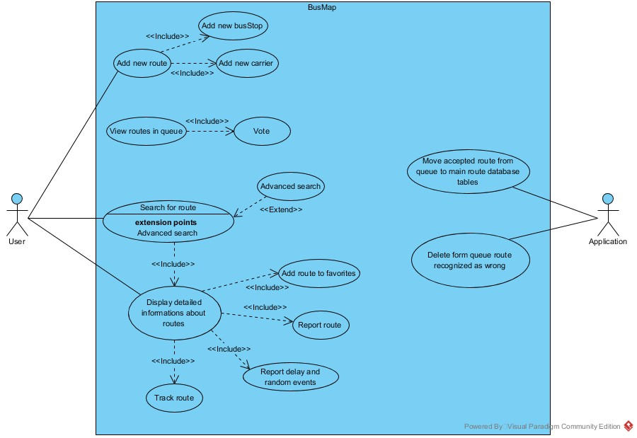
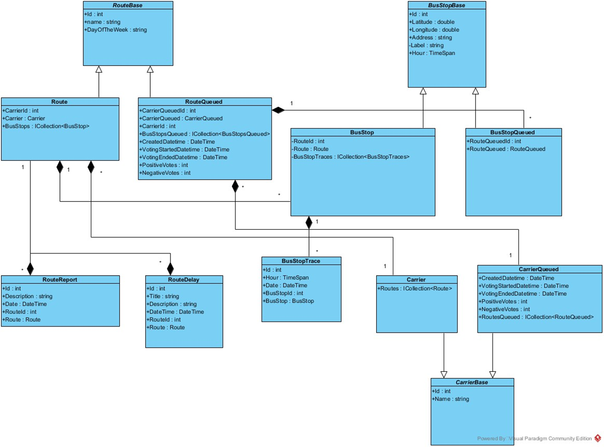
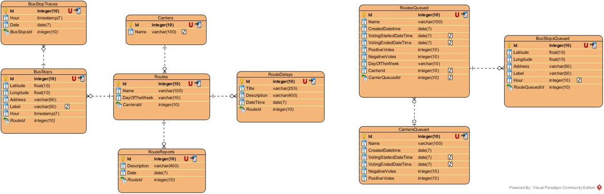
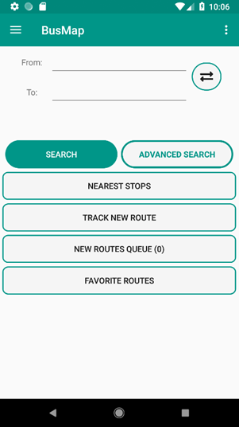
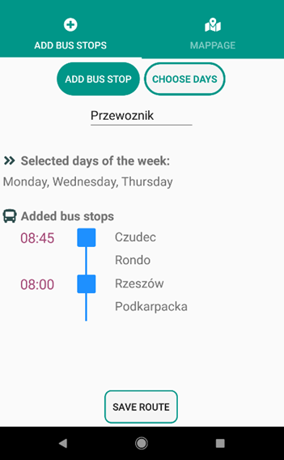
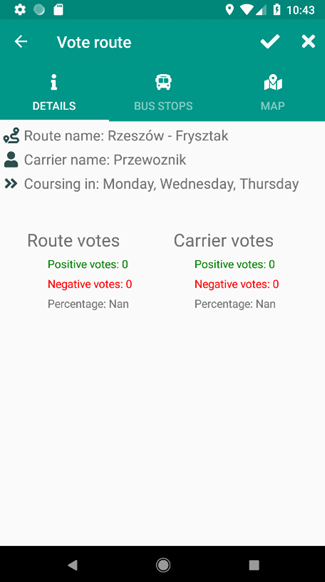
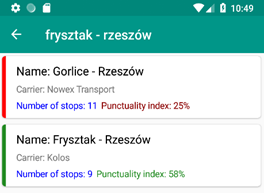
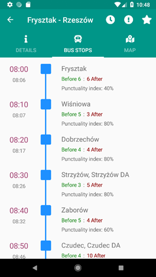
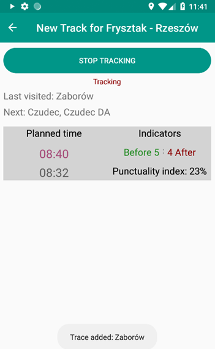
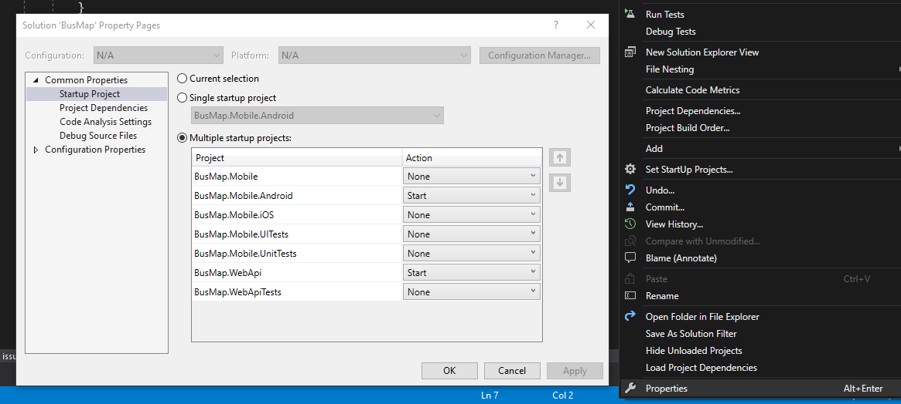

# BusMap
Community application and platform for monitoring public transport.

## Description
The purpose of this project was to design and create a platform for
public transport monitoring, allowing users to add and monitor local bus connections.
It is composed of a mobile application for Android mobile phones and REST API.
###### Application Use Case Diagram

###### Application Class Diagram

###### Application Database Diagram

## Technologies and libraries
- Xamarin.Forms
- ASP.NET Core
- Azure   
- Prism.Forms
- Xamarin.Forms.GoogleMaps
- Xam.Plugin.Geolocator
- Newtonsoft.Json  

## Description of how the application works

The application allows three main activities:
- Adding new route
- Viewing the routes in the queue
- Searching for routes   

#### Adding new route
When adding a new route, the user must define three elements: 
carrier, the days on which the course travels, and a list of stops making up the course.
When adding stops, the current phone position is downloaded, based on which the system suggests the name of the city and street.  

#### Route queue
Each correctly created road is added to the queue, where the voting process for the 
correctness of the road takes place for two weeks.  

#### Searching for courses
Two types of it have been implemented:
1. Simple - search by specifying the start and destination
2. Advanced - extended to select the day or days of the week, date, hourly interval  

Each course and stop is described by following punctuality indicators:
- Punctuality index
- Average arrival time before and after time
- Most common time (for bus stops)  

#### Road tracking
Users can start monitoring the route from any course. Thanks to this, when user tracking his position arrive the bus stop,
the date and time will be sent to the server.  
This information is used for:
- Notifying other users which bus stop bus has left recently
- Determining punctuality coefficients  

| Application part  | Screenshot |
| ------------- | ------------- |
| Adding new route  |   |
| "Route queue"  |   |
| Searching - result view  |     |
| Searching - stop details |  |
| Road tracking  |   |

## How to run project locally
1. Web API:
    - Setup data in Connections.cs file: database connection string and AzureMaps Key
    - Update database
    - Use [SharpProxy](https://github.com/jocull/SharpProxy "SharpProxy") for share web application in your local network (recommended)
    - Alternatively deploy WEB API to your local IIS server
2. Mobile application:
    - Change HttpClient API address in ApiDataService.cs
    - Set startup project as Andorid, run virtual device (or connect real one) and select it as startup target  
    - Click RMB on solution, then properties and select startup multiple projects: Web API and Android
        
    - Run projects
    

